# Food Order App


A full-stack **Order Management** application for a food delivery platform. The application allows customers to browse the menu, manage their cart, place orders with delivery details, and track order status in near real time. It also includes an admin portal for menu management and order administration.

**Live app:** [https://food-order-app-kappa-ivory.vercel.app](https://food-order-app-kappa-ivory.vercel.app)

---

## Screenshots

### Customer Home

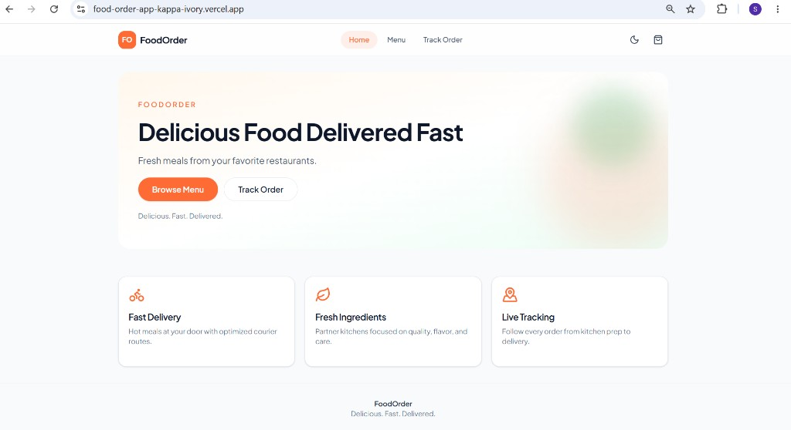

### Menu

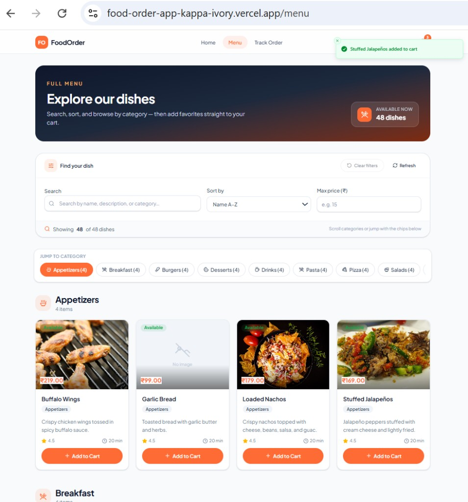

### Cart

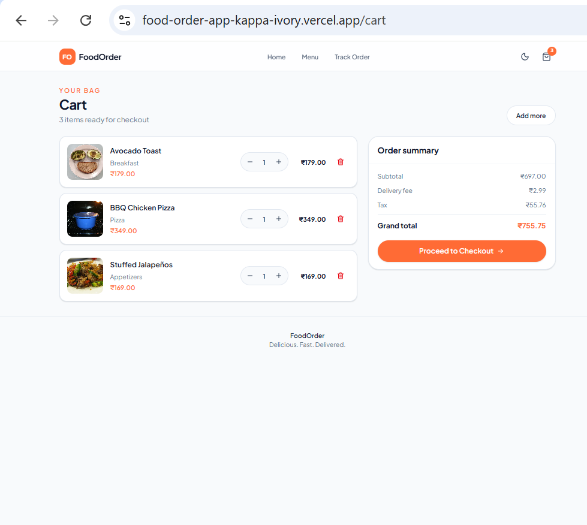

### Checkout

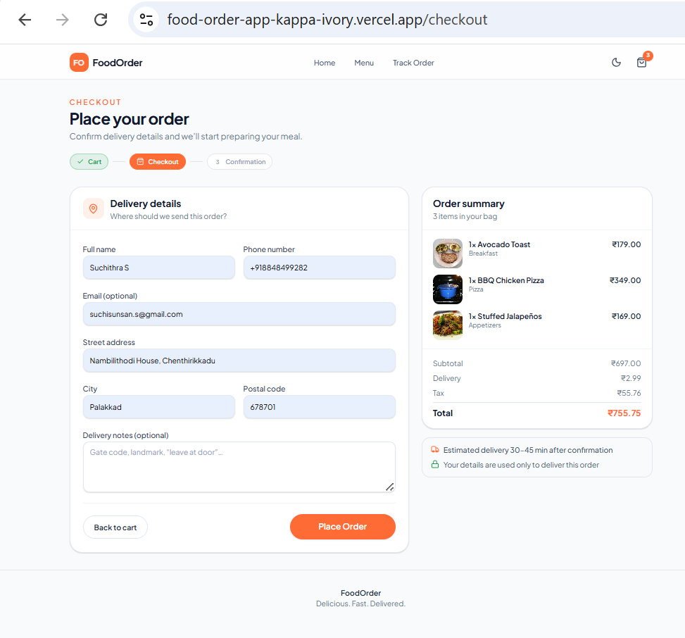

### Order Success

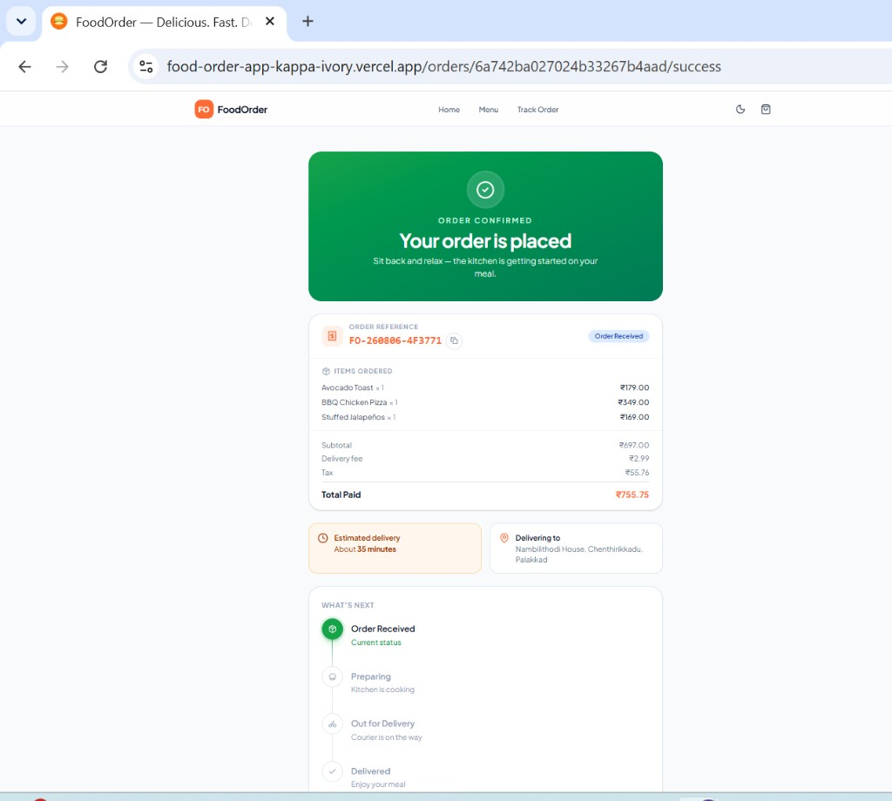

### Order Tracking

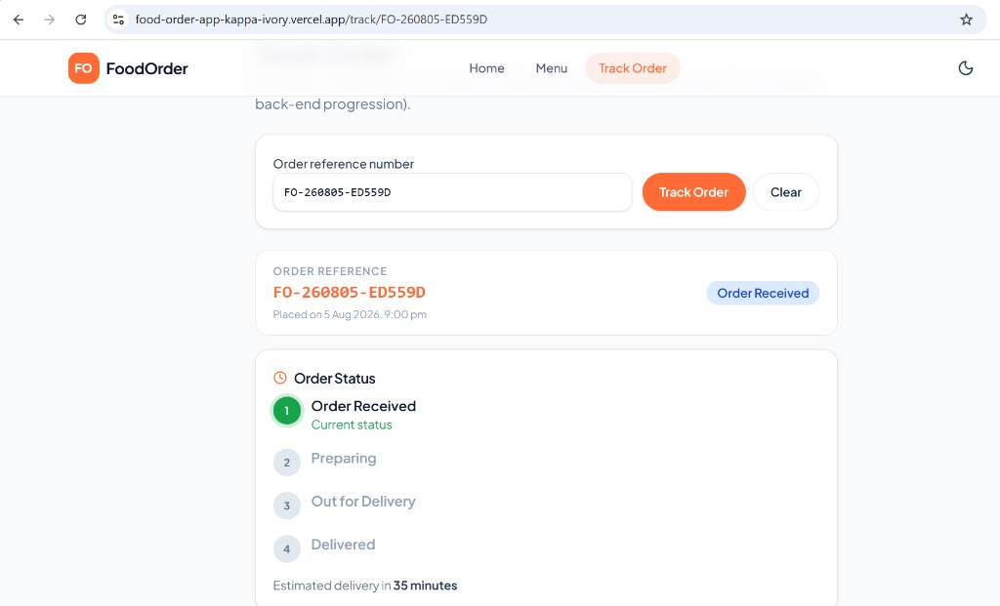

### Admin Login

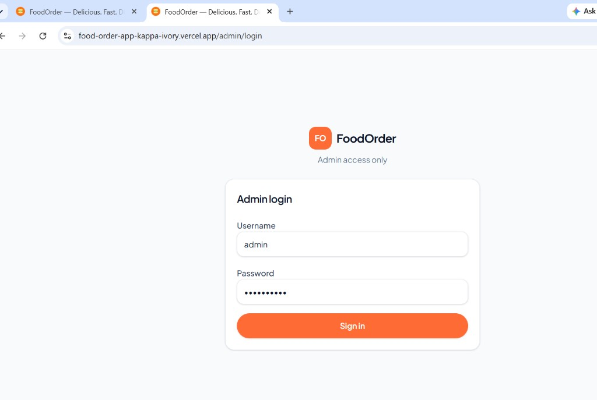

### Admin Dashboard

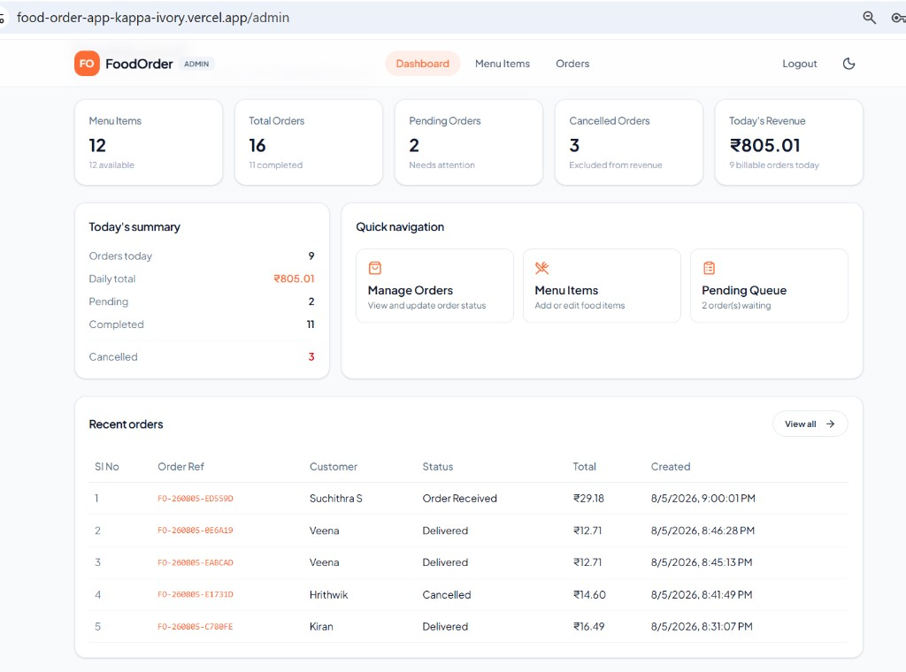

### Menu Management

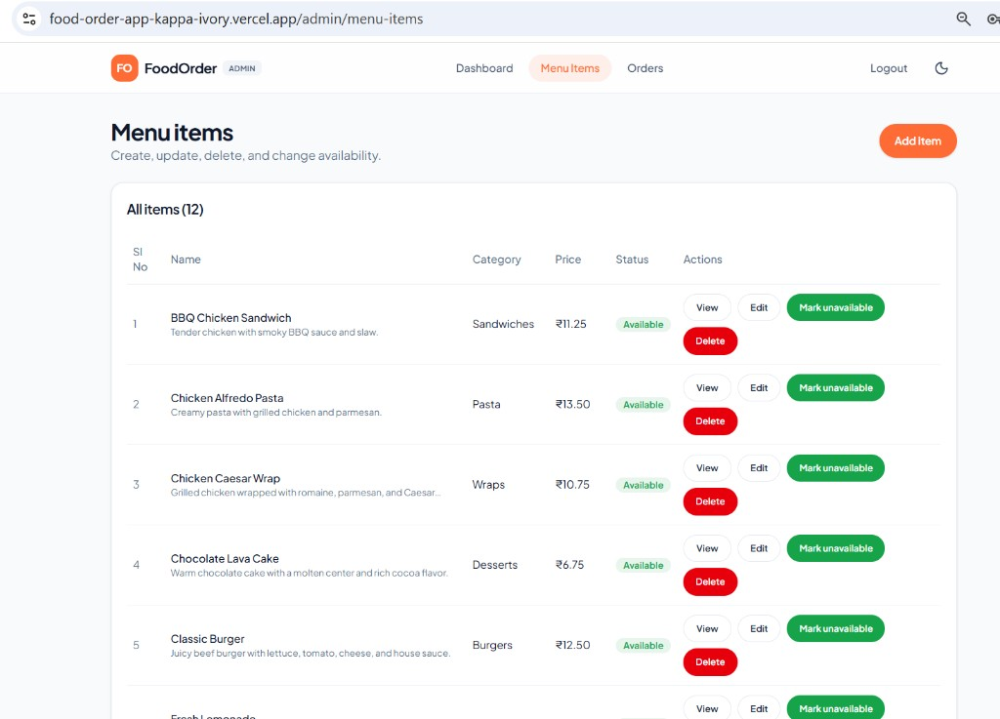

### Add Menu Item

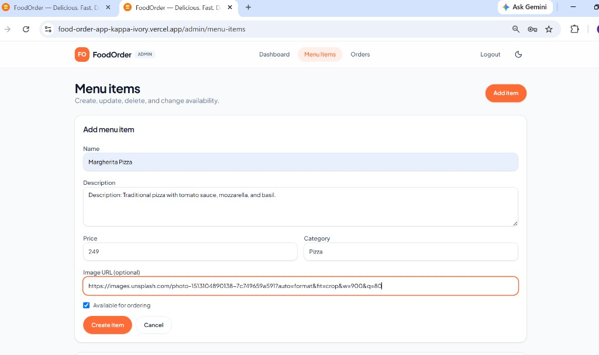

### Admin Orders

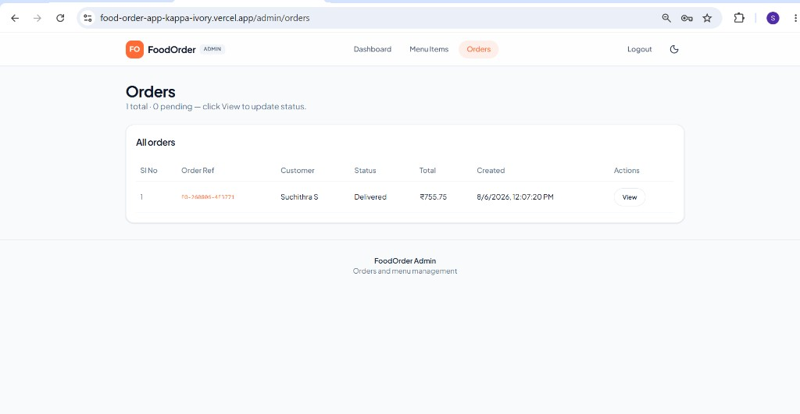

### Admin Order Details

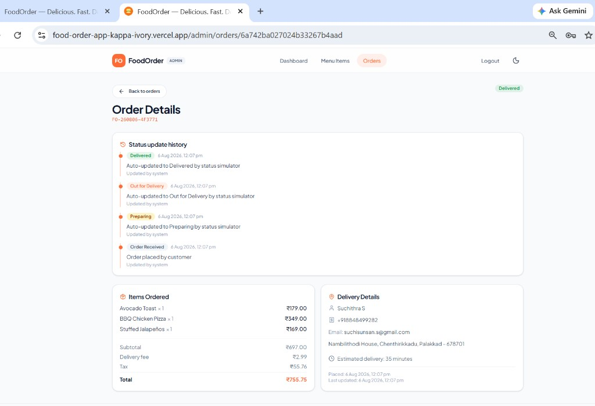

---

## Tech Stack

| Layer          | Tech                                             |
| -------------- | ------------------------------------------------------- |
| Frontend       | React 19, Vite, TypeScript, Tailwind CSS, TanStack Query, React Router |
| Backend        | Node.js, Express.js, TypeScript, Mongoose               |
| Database       | MongoDB (with in-memory fallback)                       |
| Real-Time      | Socket.IO                                               |
| Email          | Nodemailer (SMTP; console fallback when unset)          |
| Validation     | Zod                                                     |
| Testing        | Vitest, Node Test Runner                                |
| Authentication | JWT (bcrypt password hashing)                           |

---

## Features

| Area                     | Description                                                                                       |
| ------------------------ | ------------------------------------------------------------------------------------------------- |
| **Menu**                 | Home and Menu browse dishes by category (sticky tabs + sections), with search, sort, and price filters. |
| **Cart**                 | Add, remove, and update item quantities with persistent cart storage using Local Storage.         |
| **Checkout**             | Submit delivery details (name, optional email, phone, address, city, postal code) and place an order. |
| **Order Tracking**       | Track order progress through **Order Received → Preparing → Out for Delivery → Delivered**, including **Cancelled**. |
| **Real-Time Updates**    | Live status updates using Socket.IO with polling fallback and optional backend status simulation. |
| **Email Notifications**  | Order confirmation, delivered, and cancelled emails via SMTP (logged to console if SMTP is not configured). |
| **Admin Portal**         | JWT authentication, dashboard, menu CRUD, order list/detail, and status updates (including cancel). |
| **Storage**              | MongoDB persistence with automatic in-memory fallback when the database is unavailable.           |
| **Testing**              | Automated API and UI tests covering the core application workflow.                                |

---

## Assignment Requirement Coverage

| Requirement               | Status        |
| ------------------------- | ------------- |
| Menu Display              | ✅ Completed   |
| Order Placement           | ✅ Completed   |
| Order Status Tracking     | ✅ Completed   |
| REST API                  | ✅ Completed   |
| React + Vite Frontend     | ✅ Completed   |
| Automated API Tests       | ✅ Completed   |
| Automated UI Tests        | ✅ Completed   |
| Real-Time Updates         | ✅ Completed   |
| Hosted Application        | ✅ Completed   |
| Admin Dashboard *(Bonus)* | ✅ Implemented |
| Menu CRUD *(Bonus)*       | ✅ Implemented |

---

## Project Structure

```text
food-order-app/
├── client/
│   └── src/
│       ├── app/              # Router and providers
│       ├── components/       # Shared layout and UI
│       ├── features/
│       │   ├── menu/
│       │   ├── cart/
│       │   ├── order/
│       │   └── admin/
│       ├── services/
│       ├── hooks/
│       └── lib/
│
└── server/
    └── src/
        ├── config/           # Env, database, socket
        ├── middlewares/
        ├── modules/
        │   ├── menu/
        │   ├── order/
        │   └── admin-modules/
        │       ├── admin/
        │       └── menu-items/
        ├── models/
        ├── services/         # Email, shared services
        ├── data/             # Seed menu data
        ├── routes/
        └── tests/
```

---

## Architecture

```text
Browser
    │
React + Vite
    │
REST API + Socket.IO
    │
Node.js + Express
    │
MongoDB Atlas
    │
In-Memory Fallback
```

---

## Prerequisites

* Node.js 20+
* npm
* MongoDB Atlas (or a local MongoDB instance)

> **Note:** If MongoDB is unavailable, the server automatically falls back to in-memory storage for demonstration purposes. On startup, the server also bootstraps the default admin user and seed menu when needed.

---

## Quick Start

**Backend**

```bash
cd server
npm install
npm run dev
```

**Frontend**

```bash
cd client
npm install
npm run dev
```

Open: [http://localhost:5173](http://localhost:5173)

Admin login: [http://localhost:5173/admin/login](http://localhost:5173/admin/login)

---

## Local Setup

Start the **backend first**, then the frontend.

### Backend

```bash
cd server
cp .env.example .env
npm install
npm run dev
```

Default API:

```
http://localhost:3000
```

Health check: `GET http://localhost:3000/api/health`

Production build:

```bash
npm run build
npm start
```

### Backend Environment Variables

| Variable                              | Description                                                  |
| ------------------------------------- | ------------------------------------------------------------ |
| `NODE_ENV`                            | `development` or `production`                                |
| `PORT`                                | API port (default `3000`)                                    |
| `MONGO_URI`                           | MongoDB connection string                                    |
| `DATABASE`                            | Database name                                                |
| `CORS_ORIGIN`                         | Frontend origin (must match the client URL)                  |
| `ADMIN_JWT_SECRET`                    | JWT signing secret                                           |
| `ADMIN_JWT_EXPIRES_IN_SECONDS`        | Token lifetime (default `28800`)                             |
| `ADMIN_USERNAME` / `ADMIN_PASSWORD`   | Default admin credentials used for bootstrap                 |
| `ADMIN_EMAIL`                         | Admin email used during seed                                 |
| `ORDER_STATUS_SIMULATION`             | `true` = auto status + Socket push for demos; `false`/unset = admin-only updates |
| `ORDER_STATUS_SIMULATION_INTERVAL_MS` | Ms between simulated steps (default `20000`; only used when simulation is on) |
| `SEED_SECRET`                         | Optional; required to call `POST /api/admin/seed` when set   |
| `SMTP_HOST` / `SMTP_PORT`             | Optional SMTP host and port for order emails                 |
| `SMTP_USER` / `SMTP_PASSWORD`         | Optional SMTP credentials                                    |
| `SMTP_FROM`                           | Optional From header (e.g. `FoodOrder <noreply@app.com>`)    |

Default seeded administrator:

```
Username: admin
Password: admin@2026
```

Admin UI (after both apps are running):

```
http://localhost:5173/admin/login
```

**Seed / bootstrap:** On server start, admin + menu are seeded automatically when missing. You can also call `POST /api/admin/seed`. If `SEED_SECRET` is set, send it via the `x-seed-secret` header or JSON body `{ "seedSecret": "..." }`.

---

### Frontend

```bash
cd client
cp .env.example .env
npm install
npm run dev
```

Default application:

```
http://localhost:5173
```

Production build:

```bash
npm run build
npm run preview
```

### Frontend Environment Variables

| Variable         | Description                                                                 |
| ---------------- | --------------------------------------------------------------------------- |
| `VITE_API_URL`   | Public API origin (no trailing slash). Leave empty locally to use the Vite `/api` proxy. |
| `VITE_SOCKET_URL`| Optional Socket.IO origin. Defaults to `VITE_API_URL`, or `http://localhost:3000` in Vite dev. |

---

## Order Status Flow

```text
Order Received
        │
        ▼
Preparing
        │
        ▼
Out for Delivery
        │
        ▼
Delivered

        └──► Cancelled (admin can cancel before Delivered)
```

### Real-time updates + status simulation

Status changes are pushed to the track page over **Socket.IO** (with an 8s polling fallback). Auto-progression of orders is controlled by an env flag — not hard-coded:

| `ORDER_STATUS_SIMULATION` | Behavior |
| ------------------------- | -------- |
| `true` / `1` | After place order, server auto-advances **Preparing → Out for Delivery → Delivered** every `ORDER_STATUS_SIMULATION_INTERVAL_MS` (default `20000`) and emits `order:status` on Socket.IO. Best for demos / Loom. |
| `false` / unset | No auto-advance. Status only changes when an admin uses **PATCH** `/api/admin/orders/:id/status`. Socket.IO still pushes those manual updates. Best for “real” admin-driven demos and keeps API tests deterministic. |

Additional rules:

1. Customer places an order → status starts as **Order Received**.
2. If simulation is on, timers schedule the happy path and emit to rooms `order:{id}` and `order:{FO-reference}`.
3. Any **admin** status update (including cancel) **cancels** the simulator for that order so paths do not race.
4. Track page joins the Socket.IO room; if the socket is down, it still refreshes via polling.

---

## Main API Endpoints

All routes are mounted under `/api`.

| Method | Endpoint                            | Description                                      |
| ------ | ----------------------------------- | ------------------------------------------------ |
| GET    | `/api/health`                       | Health check                                     |
| GET    | `/api/menu`                         | Retrieve menu items                              |
| GET    | `/api/menu/:id`                     | Retrieve a single menu item                      |
| POST   | `/api/orders`                       | Place a new order                                |
| GET    | `/api/orders/:id`                   | Retrieve an order by ID or reference             |
| POST   | `/api/admin/login`                  | Authenticate administrator                       |
| POST   | `/api/admin/seed`                   | Bootstrap admin user, config, and seed menu      |
| GET    | `/api/admin/dashboard`              | Admin dashboard summary *(auth)*                 |
| GET    | `/api/admin/orders`                 | List orders *(auth)*                             |
| GET    | `/api/admin/orders/stats`           | Order statistics *(auth)*                        |
| PATCH  | `/api/admin/orders/:id/status`      | Update order status *(auth)*                     |
| GET    | `/api/admin/menu-items`             | List menu items for admin *(auth)*               |
| POST   | `/api/admin/menu-items`             | Create menu item *(auth)*                        |
| PATCH  | `/api/admin/menu-items/:id`         | Update menu item *(auth)*                        |
| DELETE | `/api/admin/menu-items/:id`         | Soft-delete menu item *(auth)*                   |
| PATCH  | `/api/admin/menu-items/:id/status`  | Change menu item availability *(auth)*           |

---

## Automated Testing

Run backend tests:

```bash
cd server
npm test
```

Run frontend tests:

```bash
cd client
npm test
```

### Test Results

| Area     | Result                       |
| -------- | ---------------------------- |
| Backend  | ✅ 22 Passing Tests           |
| Frontend | ✅ 9 Passing Tests            |
| Total    | ✅ 31 Passing Automated Tests |

The automated tests cover:

* Order creation
* Order retrieval
* Delivery validation
* Status transitions
* Authentication
* Menu CRUD
* Menu rendering
* Cart functionality
* Checkout validation
* Order timeline rendering

---

## Deployment

### Frontend

**Platform:** Vercel

https://food-order-app-kappa-ivory.vercel.app

**Environment variables (Vercel):**

| Variable       | Example value                              |
| -------------- | ------------------------------------------ |
| `VITE_API_URL` | `https://food-order-api-yo11.onrender.com` |

Optionally set `VITE_SOCKET_URL` to the same API origin if sockets should not inherit `VITE_API_URL`.

### Backend

**Platform:** Render

https://food-order-api-yo11.onrender.com

**Environment variables (Render):**

| Variable           | Notes                                              |
| ------------------ | -------------------------------------------------- |
| `NODE_ENV`         | `production`                                       |
| `MONGO_URI`        | MongoDB Atlas connection string                    |
| `DATABASE`         | Database name                                      |
| `CORS_ORIGIN`      | Exact frontend URL (Vercel app origin)             |
| `ADMIN_JWT_SECRET` | Strong random secret                               |
| `ADMIN_USERNAME` / `ADMIN_PASSWORD` / `ADMIN_EMAIL` | Bootstrap admin credentials |
| `ORDER_STATUS_SIMULATION` | `true` for live demos (auto status); `false` for admin-only updates |
| `ORDER_STATUS_SIMULATION_INTERVAL_MS` | Optional; default `20000` when simulation is on |
| `SEED_SECRET`      | Recommended if the seed endpoint stays enabled     |
| `SMTP_*`           | Optional; enable real order emails                 |

> **Note:** Free Render instances may cold-start after idle time; the first API request can take a few seconds.

### Demo Credentials

Use these to sign in to the hosted admin portal at
[https://food-order-app-kappa-ivory.vercel.app/admin/login](https://food-order-app-kappa-ivory.vercel.app/admin/login):

```
Username: admin
Password: admin@2026
```

---

## AI-Assisted Development

AI tools were used to assist with:

* Initial project scaffolding
* Architecture review
* Debugging
* Test case generation
* Documentation improvements

All generated code was manually reviewed, modified, integrated, and validated through automated testing before submission.

---

## Loom Demonstration

https://www.loom.com/share/b977f0b838434bdd88a81d9b20cf341c

The project walkthrough covers:

* Requirement analysis
* Project architecture
* Folder structure
* Customer ordering workflow
* Admin dashboard
* Real-time order updates
* Automated testing
* AI-assisted development process
* Challenges encountered and solutions implemented

---

## Future Improvements

* Online payment gateway integration
* Customer authentication
* Order history
* Push notifications
* Google Maps integration
* Restaurant management module

---

## License

ISC
